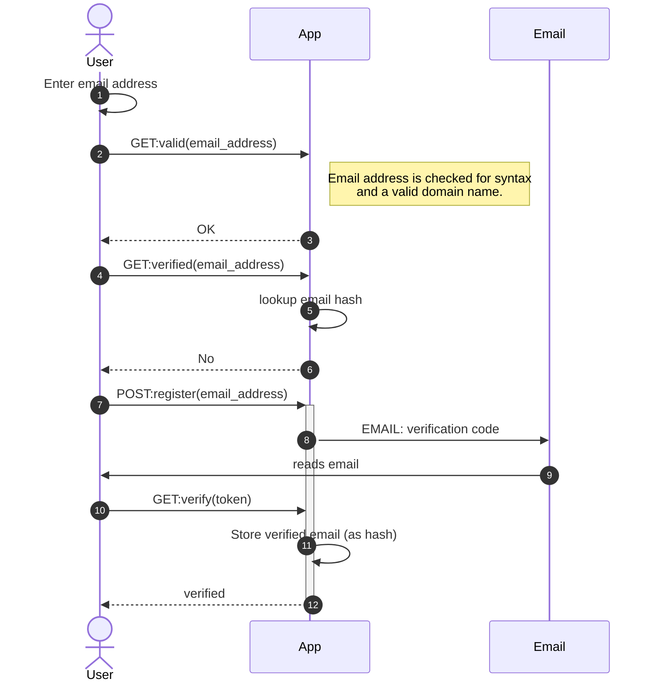

# vmail

Email verification service.

`vmail` is a simple email validation and verification service that may be used to determine if an email address is likely associated with a person.

Access to deployed instances requires an API key.

No actual email addresses are stored in the `vmail` cache. Instead, email address identifiers are created from a seeded hash of the email address. It is not possible to reverse the hash to an address.

A typical workflow for email verification is:



① User requests email verification (e.g. form entry).

② (optional) A call is made to `vmail` to check validity of the email address (syntax and DNS).

④ A call is made to this service with the email address as a parameter.

⑥ The response indicates if the email is known. 

⑦ If not known, a call is made to verify the address. This service emails a one-time-password (OTP) to the address.

⑩ The email recipient clicks on a link in the email or enters the OTP in a form.

⑫ If the code matches, the email is marked as verified.


## Deployment

The service may be deployed anywhere that can run FastAPI. Deployment to vercel is described here. 

The default configuration must be adjusted using a .env file or setting environment variables. The following variables will likely need to be set:

| Variable                     | Description                                                                                 |
|------------------------------|---------------------------------------------------------------------------------------------|
| `VMAIL_SMTP_HOST`            | Hostname of the SMTP server to use                                                          |
| `VMAIL_SMTP_PORT`            | Port of the SMTP server                                                                     |
| `VMAIL_SMTP_USER`            | Username for authenticating with the SMTP server                                            |
| `VMAIL_SMTP_PASSWORD`        | Password for the SMTP server                                                                |
| `VMAIL_SMTP_FROM`            | The "from" address that will be used for emails sent from this service.                     |
| `VMAIL_SMTP_SSL`             | Boolean value indicating if SSL connection is to be used for connecting to the SMTP server. |
| `VMAIL_SMTP_STARTTLS`        | Boolean value indicating if Start-TLS will be used when connecting to the SMTP server.      |
| `VMAIL_DB_CONNECTION_STRING` | The sqlalchemy database connection string to use for the verified cache.                    |
| `VMAIL_API_KEYS` | A dictionary of `{name : api_key}` |

[Mailtrap](https://mailtrap.io/) is a good choice for an SMTP server during testing. It's configuration will be something like:

```
VMAIL_SMTP_HOST="sandbox.smtp.mailtrap.io"
VMAIL_SMTP_PORT=2525
VMAIL_SMTP_USER=<user name>
VMAIL_SMTP_PASSWORD=<password>
VMAIL_SMTP_FROM="vmail@example.com"
VMAIL_SMTP_SSL=false
VMAIL_SMTP_STARTTLS=true
```

Since Vercel deployments can not preserve state to the local file system, it is necessary to use a database service. [ElephantSQL](https://www.elephantsql.com/) is one option for a small postgres database that may be sufficient for running a `vmail` instance.

The connection string for an ElphantSQL instance will look something like:

```
VMAIL_DB_CONNECTION_STRING="postgresql+psycopg://<user>:<password>@<server>/<database>?ssl=true"
```

The API_KEYS are set via the envionment variable `VMAIl_API_KEYS`, the value of which is a JSON dictionary. For example, an API key with name "test" and value "test-key" will be set like:

```
VMAIl_API_KEYS='{"test":"test-key"}'
```

The value of the API key should be lengthy and random.

Initializing the `vmail` cache database is performed using a separate management script, `manage.py`.

```
python manage.py --help
usage: manage.py [-h] [-c CONFIG] [{initialize,clear}]

positional arguments:
  {initialize,clear}    Command to run

optional arguments:
  -h, --help            show this help message and exit
  -c CONFIG, --config CONFIG
                        Enviroment file for settings
```

After configuring the necessary environment variables and initializing the database, deployment to vercel may proceed.

To deploy to vercel preview:

```
vercel
```

Deploying to production:
```
vercel --prod
```

